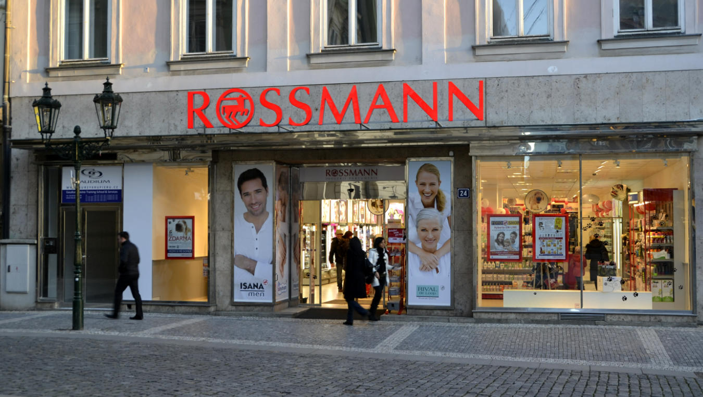

# Machine-Learning-Project-Rossmann-Store-Sales-
# Rossmann Sales Prediction

## Problem Statement

Rossmann operates over 3,000 drug stores across 7 European countries. Currently, store managers rely on their own predictions for daily sales, leading to varying levels of accuracy. The objective of this project is to develop a machine learning model that can forecast the "Sales" column for the test set. The dataset provided includes historical sales data for 1,115 Rossmann stores, taking into account factors such as promotions, competition, school and state holidays, seasonality, and store locality. It is worth noting that some stores in the dataset were temporarily closed for refurbishment.

## Dataset

The dataset used in this project is from the [Rossmann Store Sales competition on Kaggle](https://www.kaggle.com/c/rossmann-store-sales). 
You can also check out my [GDrive](https://drive.google.com/drive/folders/1JuVBJ3ueoFtOVEPYplmd2Ks4HMV34T43?usp=sharing), it has all the dataset that were used in this project.
It includes historical sales data for 1,115 Rossmann stores over a period of 2.5 years.

### Features

- **Store**: a unique identifier for each store
- **Sales**: the target variable, representing daily sales
- **DayOfWeek**: the day of the week (1=Monday, 7=Sunday)
- **Date**: the date of the sales
- **Customers**: the number of customers on that day
- **Open**: whether the store was open (0=closed, 1=open)
- **Promo**: whether the store was running a promotion
- **StateHoliday**: whether the day was a state holiday
- **SchoolHoliday**: whether the day was a school holiday
- **StoreType**: the type of store (a, b, c, d)
- **Assortment**: the level of product assortment (a=basic, b=extra, c=extended)
- **CompetitionDistance**: distance to the nearest competitor
- **CompetitionOpenSinceMonth**: the month the nearest competitor opened
- **CompetitionOpenSinceYear**: the year the nearest competitor opened
- **Promo2**: whether the store is participating in a continuous promotion
- **Promo2SinceWeek**: the week since the store is participating in Promo2
- **Promo2SinceYear**: the year since the store is participating in Promo2
- **PromoInterval**: describes the intervals when Promo2 is started

## Project Summary

The Rossmann Sales Prediction project involved extensive data analysis, feature engineering, and model selection to accurately forecast sales. Here is a brief overview of the project steps and key findings:

### 1. Data Gathering and Cleaning

- Collected historical sales data for Rossmann stores, including competitor details, holidays, customer count, and daily sales.
- Performed data cleaning to handle missing values and ensure data consistency.
- Merged relevant datasets to enhance the feature set.

### 2. Exploratory Data Analysis (EDA)

- Conducted in-depth EDA by exploring univariate, bivariate, and multivariate relationships.
- Generated insightful visualizations to uncover patterns and trends in the data.
- Extracted meaningful insights to inform future decision.

### 3. Feature Engineering and Preprocessing

- Created additional features such as `PromoDuration` and `CompetitionDuration` to capture relevant information.
- Addressed multicollinearity among independent variables using variance inflation factor (VIF) analysis.
- Detected and treated outliers using the Interquartile Range (IQR) technique.
- Encoded categorical variables using One-Hot Encoding for compatibility with machine learning algorithms.

### 4. Model Selection and Training

- Split the preprocessed data into training and testing sets.
- Utilized a variety of machine learning algorithms, including linear regression, random forests and XGBoost.
- Evaluated model performance using metrics such as R-squared score, accuracy, and mean absolute percentage error (MAPE).
- Employed regularization techniques (e.g., Lasso, Ridge, Elastic Net) for improved model performance.
- Identified XGBoost as the optimal model due to its good accuracy and an R-squared score of 0.96.

### 5. Model Deployment and Conclusion

- Finalized the XGBoost model for deployment, as it demonstrated the highest accuracy and the least error.
- Developed a comprehensive machine learning pipeline that combines data processing, feature engineering, and model evaluation.
- Successfully created a model capable of accurately predicting sales for Rossmann stores.

This project showcases the effective utilization of data analysis, feature engineering, and machine learning techniques to solve a real-world forecasting problem. The insights gained from the analysis provide valuable information for decision-making within the retail industry.

Feel free to explore the code and documentation provided in this repository to gain a deeper understanding of the project and replicate the results and if you have any questions or suggestions, please don't hesitate to reach out on this [email](jabcd.1997@gmail.com)

Happy forecasting!
